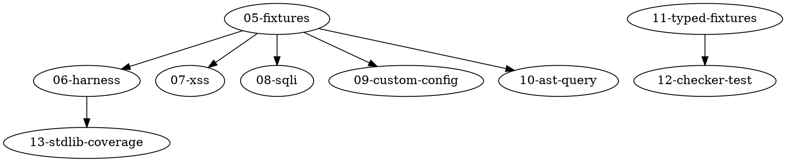

# Dependency Graph

Merge-order DAG for the impl plans in this directory. An arrow `A -> B`
means B must land before A.

```
  01-rank-aggregate        (no deps — self-contained eval change)
  02-annotation-private    (no deps)
  03-annotation-deprecated (no deps)
  04-tsgo-direct-go-api    (no deps — replaces existing JSON-RPC impl)

  05-compat-query-fixtures (no deps — only adds files)
       │
       ├─> 07-compat-find-xss-golden
       ├─> 08-compat-find-sqli-golden
       ├─> 09-compat-custom-config-golden
       └─> 10-compat-ast-query-golden
                 │
                 ▼
  06-compat-e2e-harness    (depends on 05; wires fixtures into Go test)
                 │
                 ▼
  07..10 golden-diff tests flip from standalone lint to real assertions
                 │
                 ▼
  13-stdlib-class-coverage (depends on 06; reuses harness)

  11-typed-ts-fixtures     (no deps)
       │
       ▼
  12-typecheck-checker-test (depends on 11)

  14-adversarial-review-checklist (no deps — docs only)
```

## Notes

- Plans 05 and 06 are separated because the fixtures land first as static
  files (reviewable in isolation) and the harness lands second once the
  fixtures exist. Keeps each diff small.
- Plans 07–10 can be executed in any order once 05 is in. They are
  grouped together only because they share the harness.
- Plans 01–04 are independent of the testing plans and can land first
  or last. Order them earlier in the merge queue because they touch
  core evaluation code — test plans should run against the latest
  semantics, not the old ones.
- Plan 13 is intentionally last; it is a coverage matrix and will need
  to be updated as 07–10 land, so landing it too early creates churn.

## Dot syntax (for future rendering)


